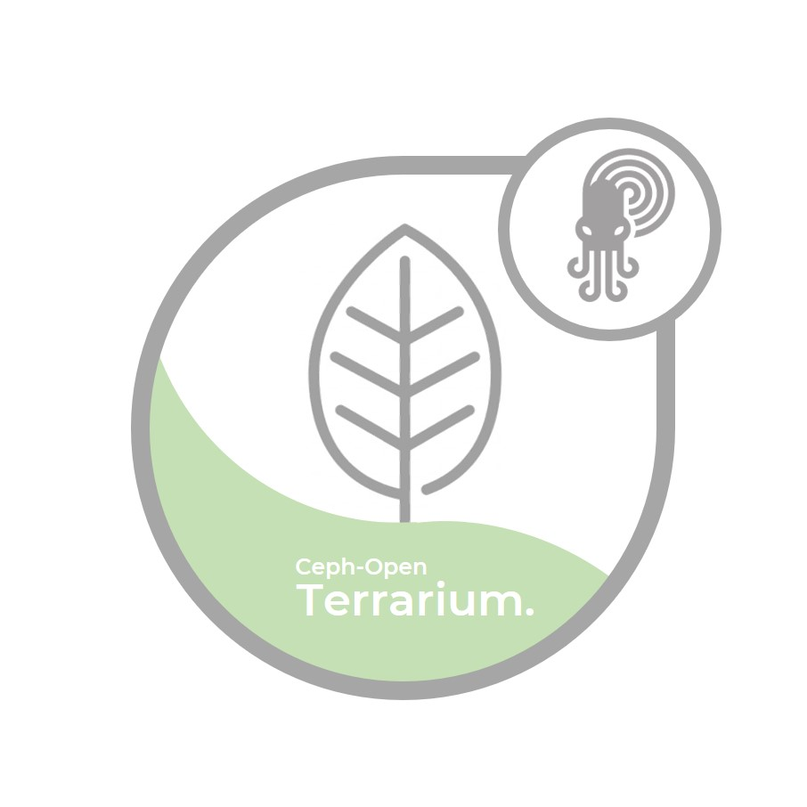

# Ceph-Open-Terrarium
Ceph-Open-Terrarium lets deploy a ceph clust via terraform with saltstack or ansible or any other config mgmt tool.

# Design-Architecture:

The architecture of project doesn't mix deployment with config management.
So you will be able to do `terraform apply` for preparing your envinroment and use the config management of your choice for setup `ceph`

### Deploy:

Deployment will focus on libvirt-kvm.
ceph-open-terrarium will use https://github.com/dmacvicar/terraform-provider-libvirt  for deploying via terraform and cloudinit.

( Due to the modular nature of terraform, we might add terraform for cloud or other providers but for the first releases is out of scope.)

### Config Management:

In roadmap i plan to give support for saltstack and ansible

Ceph related
1) https://github.com/ceph/ceph-ansible
2) https://github.com/SUSE/DeepSea

# Roadmap:

#### Currently under development. Feel free to grab issues for helping! 

### Terraform

0) Create terraform module structures.
1) Create ubuntu/opensuse/fedora etc support images

## Saltstack

Setup minimal config and use deepsea

## Ansible

Reuse as much as possible the ansible-ceph

